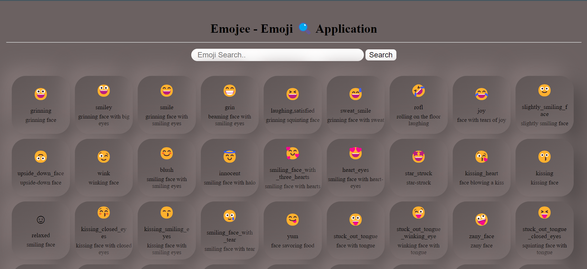
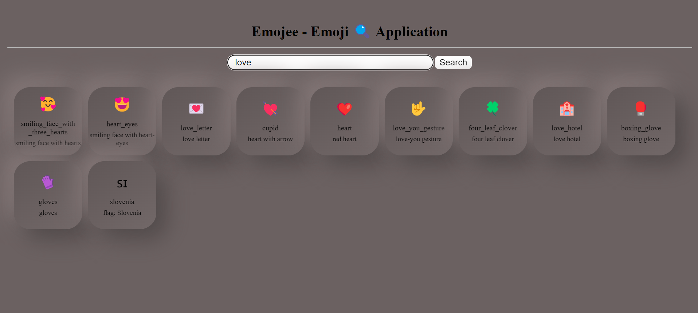

# Emoji Finder Project

Hosted Link :-https://emoji-project-drab.vercel.app/

## Overview
This GitHub repository hosts the Emoji Finder project, a fun and interactive web application designed to help users easily find emojis based on their input. Whether you're looking for a specific emoji or just want to discover new ones, this project has you covered.

## Features
Emoji Search: Use the input box to search for emojis by typing keywords, expressions, or emotions.  
Interactive Interface: The project provides a user-friendly interface, making emoji discovery a delightful experience.  
Extensive Emoji Collection: A vast collection of emojis is available, ensuring that you can find the perfect emoji for any situation.  

## Technologies Used
HTML
CSS
JavaScript

